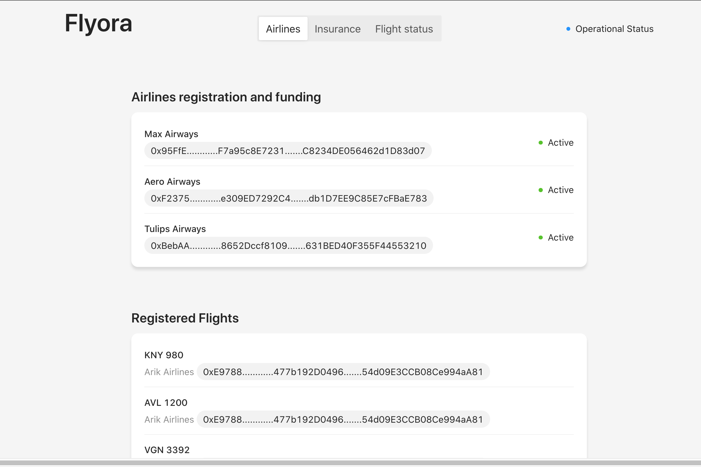
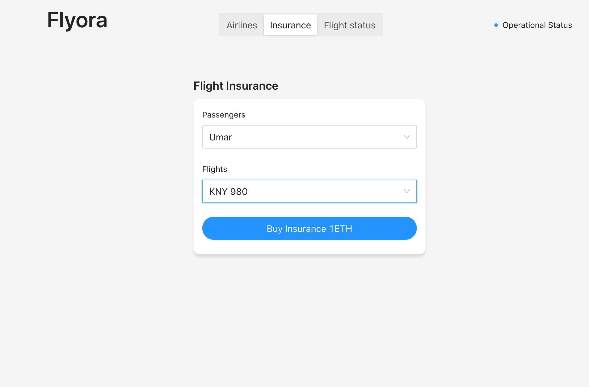
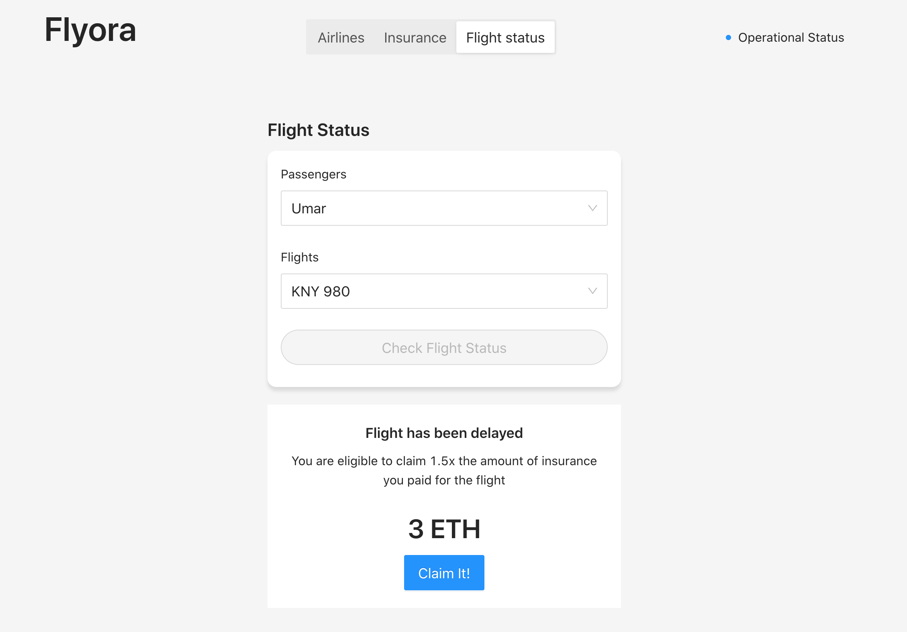

# Flyora

FlightSurety is a decentralised application for purchasing insurance for flights registered by registered airlines. Passengers who have insured a flight will be able to receive insurance payouts whenever there's any flight delay caused by the airlines. These payouts will be executed automatically solely based on the flight status of the insured flights, without needing approval from any third-party.  

## Components of the dapp

### Register and fund airlines
The dapp will have an interface to register airlines that will register and provide seed funding for which insurance to insurees will be paid from.

### Register flights
This interface features flights that have been registered by active airlines, which makes the flights eligible to be insured.

  

### Purchase insurance
This interface will allow for a passenger to purchase insurance for flights that have been registered by active airlines(registered and funded).

  

### Check flight status
This is the meaty part of the dapp that allows the passengers to check the status of the flights they bought insurance for, in order to determine whether or not they are eligible to claim insurance payouts.  

  

The eligibility of the insurance payout is determined by the following possibilities that could cause a flight delay.  

- If your trip gets cancelled due to a *technicality* ------ You get payed!
- If your trip gets cancelled due to *weather conditions* ------- You get payed!
- If your trip gets cancelled due to *lateness of the airline* ------- You get payed!
- If your trip gets cancelled due to * an unknown reason* ------- You get payed!  

If a flight gets delayed due to any of the afforementioned possibilities, then the passengers gets paid `1.5X` the amount they paid for the insurance.  

## Install

This repository contains Smart Contract code in Solidity (using Truffle), tests (also using Truffle), front-end built using `create-react-app` and server app in `nodeJS` which mimics the behaviour of an oracle.

To install, download or clone the repo, then:

`npm install`
`truffle compile`

## Develop Client

You need to move into the `src/dapp` directory and run the following command  

`npm install`

To run truffle tests for smart-contract and oracles: Execute the following commands in the root directory.  

`truffle test ./test/flightSurety.js` — For testing smart-contract code
`truffle test ./test/oracles.js` — For testing server app which mimics oracles.

To use the dapp:

`truffle migrate`
`npm run dapp`

To view dapp:

`http://localhost:8000`

## Develop Server

`npm run server`
`truffle test ./test/oracles.js`

## Deploy

Deploy the contents of the ./dapp folder

## Resources

* [How does Ethereum work anyway?](https://medium.com/@preethikasireddy/how-does-ethereum-work-anyway-22d1df506369)
* [BIP39 Mnemonic Generator](https://iancoleman.io/bip39/)
* [Truffle Framework](http://truffleframework.com/)
* [Ganache Local Blockchain](http://truffleframework.com/ganache/)
* [Remix Solidity IDE](https://remix.ethereum.org/)
* [Solidity Language Reference](http://solidity.readthedocs.io/en/v0.4.24/)
* [Ethereum Blockchain Explorer](https://etherscan.io/)
* [Web3Js Reference](https://github.com/ethereum/wiki/wiki/JavaScript-API)